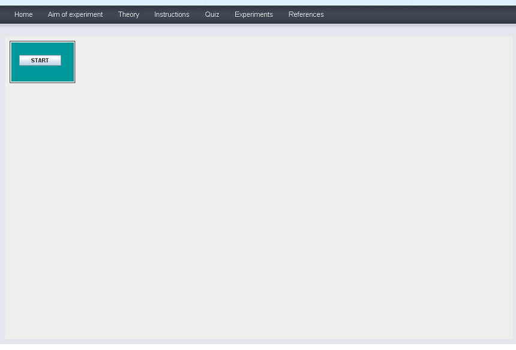
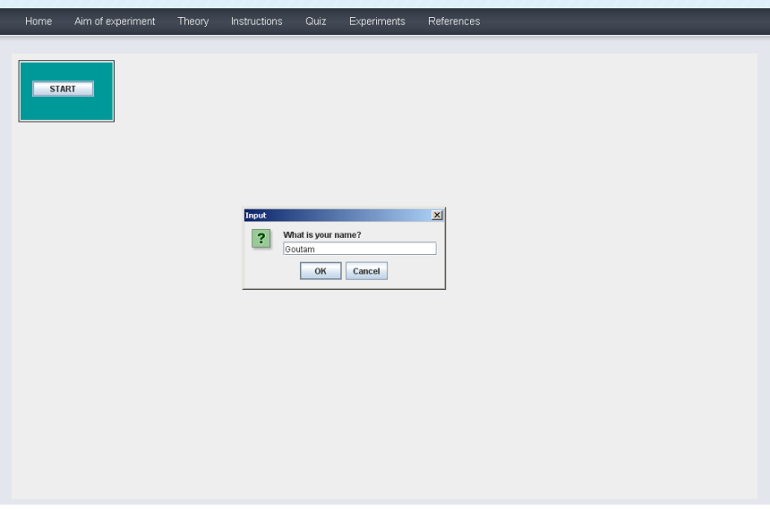
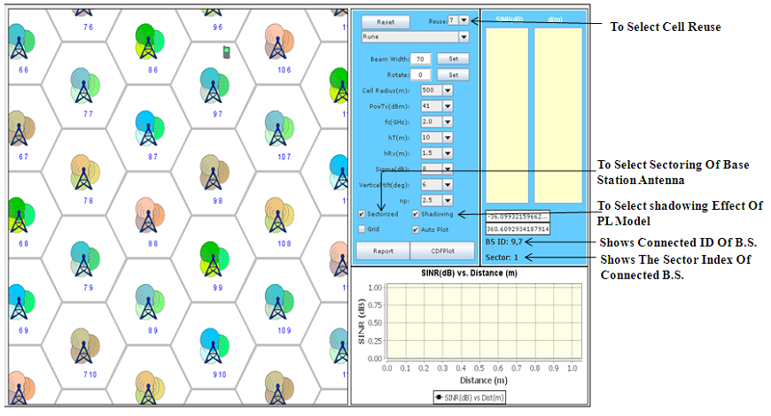
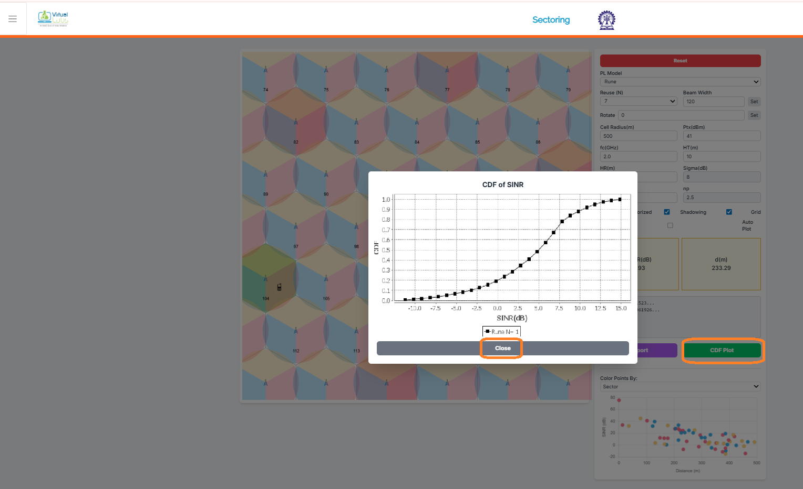
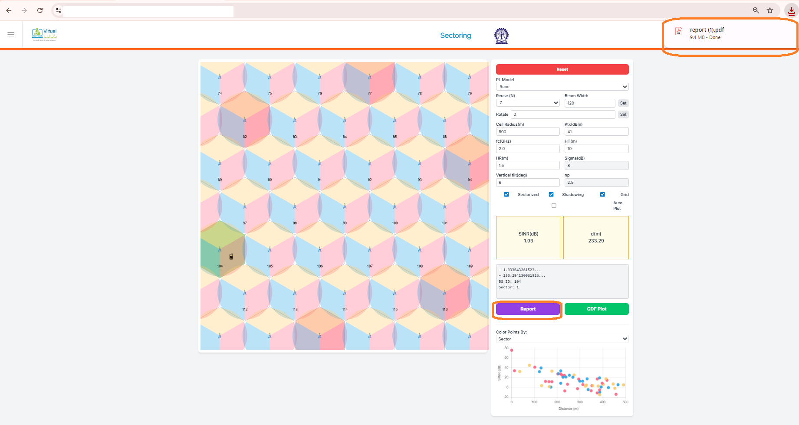
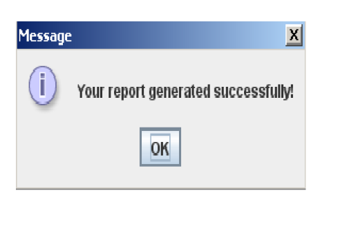

## Procedure

Follow the instructions given below to perform the experiments:-

* Step 1:- A page appears with a dialogue box asking for your name. Enter your name then Click Ok.

   

      
      

* Step2:- Select the parameters (e.g: Reuse ,Environment, Beamwidth,Carrier frequency etc.)

    

      
      

* Step3:- Take the readings by replace the mobile's location in different places of the screen using mouse

    

      
      

      
* Step4:- Click on "CDF plot" button to get plot of CDF vs SINR(dB)

   

      
      

* Step5:- Click on the "Report" button to generate PDF report of the experiment.

    

      
      

* Step6:- Click on the "Ok" and you will get your Report.

    

      
      

* Step7:- To Redo the experiment click on "RESET" button.

    
