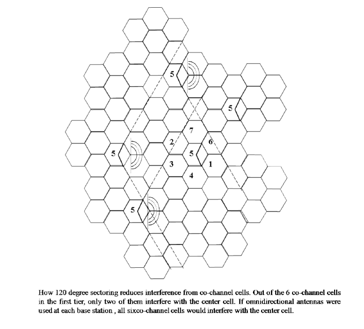

## Theory
**Introduction:**  
This experiment is better needed to be guided by a teacher. A teacher can limit the variable and give a specific task to the students. For example an experiment can be designed by fixing all parameters expects the transmit power.
Now the students may be asked to find the Tx power of the B.S at which the ten percentile SIR is greater than say 0dB

# Theory for Experiment 7:-Effects of propagation and B.S. con figuration on C/I distribution

Experiments 1 through 6 cover the fundamental aspects required to understand cellular mobile communication system. Concepts of path loss, shadowing, antenna height, horizontal beam pattern, vertical beam tilt, boundary coverage probability and calculation of SINR have been explained in details. Along with these, the concept of clustering and frequency reuse has also been explained. This particular experiment combines all the previous concepts which together comprise a basic cellular mobile communication system. Therefore it is a pre-requisite that all previous experiments be completed before starting on this.

One of the concepts introduced here is sectoring. By means of sectoring a cell is split into 3 sectors each covering `120^o`.

      
      

It can be easily seen that the number of interfering sites drastically reduce for a given reuse factor. In effect, the carrier to interference ratio at a cell edge in downlink becomes.

$$(P_T * d^{-n_p}) / (P_T * \sum_{i=1}^{2} d_i)$$

whereas for Omni directional cell the C/I is

$$(P_T * d^{-n_p}) / (P_T * \sum_{i=1}^{6} d_i)$$

Thus there in a 3 folds increase in C/I by virtue of sectoring.

Thus SINR at cell edge can be improved. Since a service does not require an SINR greater than a certain threshold, therefore by using sectoring the cluster size can be reduced thereby increasing capacity.

Now in this experiment since all possible parameters have been considered, it is a complex mix of several effects. Therefore the student is urged to vary different parameters and compare the effects on distribution of C/I.

## 1.1 Example

It is given that the minimum required SINR at cell edge is 15 dB. Suggest the frequency reuse plan for omnidirectional antenna at base station. What is the impact of using 120 degrees antenna at the base station. (consider `$n_p=4$`)

Given that,

$|S/I|_(req)$=required signal noise interference ratio=15dB=`10^(15/10)`,
n= pathloss exponent=4,
`$i_0$`=no. of co-channel interference.
N= cluster size.

Without sectoring,
The no of interference in the first tier is six

$$S/I = ( (sqrt(3N))^n ) / i_0$$

$$\Rightarrow (sqrt(3N))^4 = 6 \times 10^(1.5)$$

$$\Rightarrow 9N^2 = 6 \times 10^(1.5)$$

$$\Rightarrow N = 4.5 \approx 5$$

With sectoring,use 120 degree antenna
The no of interference in the first tier reduced from six to two

$$S/I = ( (sqrt(3N))^n ) / i_0$$

$$\Rightarrow (sqrt(3N))^4 = 2 \times 10^(1.5)$$

$$\Rightarrow 9N^2 = 2 \times 10^(1.5)$$

$$\Rightarrow N = 2.6 \approx 3$$
     
 
